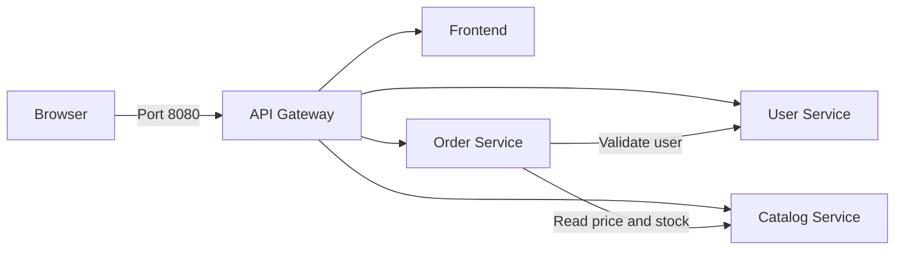
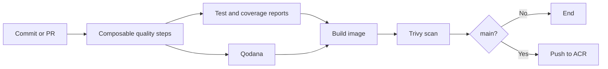

# NexusCart Configuration Management

This repository owns the configuration used to integrate, verify, and deploy
the NexusCart system. It contains local Docker Compose orchestration, Helm
charts for AKS, reusable Azure Pipeline templates, operational scripts, and
the shared API contract.

Application source remains in the five sibling runtime repositories.

## ✨ Highlights

- Full-stack Docker Compose environment for local development and E2E testing.
- One Helm chart per deployable component.
- DEV and PROD resource overrides for AKS.
- Centralized Azure Pipeline stage, job, and composable step templates.
- Cross-repository system E2E pipeline.
- Health, readiness-wait, and order smoke-test scripts.
- Central API contract for users, products, orders, errors, and health.
- Immutable deployment versions based on Azure Pipeline build IDs.

## 🏗️ Application Architecture

| Component | Runtime | Internal port | Role |
|---|---|---:|---|
| `frontend` | React, Vite, NGINX | `80` | Storefront UI |
| `api-gateway` | Node.js HTTP | `8080` | Public entry point, routing, and health dashboard |
| `user-service` | Go, Gin | `8081` | Seeded customer data |
| `catalog-service` | Python, FastAPI | `8082` | Product, price, and stock data |
| `order-service` | Java, Spring Boot | `8083` | Order validation, totals, and in-memory storage |



Only the API Gateway publishes a host port in Compose and a public
`LoadBalancer` service in Kubernetes. All other components stay on the
internal application network.

## 🗂️ Multi-Repository Layout

Clone all six repositories as siblings. Compose build contexts and the E2E
pipeline rely on this layout:

```text
AzureDevOps/
├── frontend/
├── api-gateway/
├── user-service/
├── catalog-service/
├── order-service/
└── config-management/
```

## 🚀 Run the Full Stack

### Prerequisites

- Docker Engine with Docker Compose v2.
- All six repositories in the sibling layout shown above.

From `config-management`:

```powershell
Copy-Item .env.example .env
docker compose config --quiet
docker compose up --build --detach --wait
```

Open:

- Storefront: <http://localhost:8080>
- Health dashboard: <http://localhost:8080/health>
- Gateway health JSON: <http://localhost:8080/health/api-gateway>

Verify the integrated system:

```powershell
./scripts/health.ps1 -BaseUrl http://localhost:8080
./scripts/smoke.ps1 -BaseUrl http://localhost:8080
```

The smoke test reads users and products, creates an order through the public
gateway, and reads the saved order back.

Stop the environment:

```powershell
docker compose down --remove-orphans
```

To expose a different host port or health version:

```powershell
$env:APP_PORT = "9080"
$env:APP_VERSION = "local-2"
docker compose up --build --detach --wait
```

The application is then available at <http://localhost:9080>.

## ⚙️ Compose Configuration

| Variable | Default | Purpose |
|---|---|---|
| `APP_PORT` | `8080` | Host port published by the API Gateway |
| `APP_VERSION` | `1.0.0` | Version reported by every component |
| `FRONTEND_URL` | `http://frontend:80` | Gateway frontend target |
| `USER_SERVICE_URL` | `http://user-service:8081` | Gateway and Order user target |
| `CATALOG_SERVICE_URL` | `http://catalog-service:8082` | Gateway and Order catalog target |
| `ORDER_SERVICE_URL` | `http://order-service:8083` | Gateway order target |

Copy `.env.example` to `.env` for persistent local overrides. Do not commit
credentials or environment-specific secrets to this file.

## 🌐 Public Routes

| Path | Destination |
|---|---|
| `/` and non-API paths | Frontend |
| `/api/v1/users/*` | User Service |
| `/api/v1/products/*` | Catalog Service |
| `/api/v1/orders/*` | Order Service |
| `/health` | Integrated health dashboard |
| `/health/{component}` | Stable component health route |

All payloads use `camelCase`, timestamps use ISO 8601 UTC, and VND amounts are
integers. See [docs/api-contract.md](docs/api-contract.md) for request, response,
and error examples.

## 🩺 Operational Scripts

| Script | Purpose |
|---|---|
| `scripts/wait-health.ps1` | Polls all component health routes until ready or timed out |
| `scripts/health.ps1` | Reports component status, version, latency, and optional version match |
| `scripts/smoke.ps1` | Runs an end-to-end read/create/read order scenario |

Verify one deployed service reports the expected immutable version:

```powershell
./scripts/health.ps1 \
  -BaseUrl https://dev.example.com \
  -ExpectedService order-service \
  -ExpectedVersion 1234
```

## 🔁 CI/CD Flow

Each runtime repository keeps a small `azure-pipelines.yml` entry point. It
calls the shared stage/job templates and passes a typed `stepList` composed of
reusable checkout, runtime setup, dependency install, test, report, build, and
Qodana step templates.



The separate `pipelines/system-e2e.yml` pipeline checks out all six
repositories, starts the Compose stack, validates health and ordering behavior,
and publishes Compose diagnostics if the test fails.

See [pipelines/README.md](pipelines/README.md) for template composition, Azure
DevOps setup, Qodana requirements, image tagging, and pipeline creation.

## ☸️ Helm and AKS

| Chart | Service type | DEV replicas | PROD replicas |
|---|---|---:|---:|
| `frontend` | `ClusterIP` | 1 | 2 |
| `user-service` | `ClusterIP` | 1 | 2 |
| `catalog-service` | `ClusterIP` | 1 | 2 |
| `order-service` | `ClusterIP` | 1 | 1 |
| `api-gateway` | `LoadBalancer` | 1 | 2 |

Order Service remains at one PROD replica because its current storage is
process-local. Add shared persistence before scaling it horizontally.

Validate the charts:

```bash
for chart in frontend user-service catalog-service order-service api-gateway; do
  helm lint "deploy/helm/$chart"
  helm template "$chart" "deploy/helm/$chart" >/dev/null
done
```

Example DEV deployment:

```bash
helm upgrade --install api-gateway deploy/helm/api-gateway \
  --namespace dev \
  --create-namespace \
  --values deploy/helm/api-gateway/values-dev.yaml \
  --set image.repository=example.azurecr.io/api-gateway \
  --set image.tag=1234 \
  --set appVersion=1234
```

Replace the example registry and tag with real ACR values. The pipeline applies
the same overrides automatically.

## 📁 Repository Structure

```text
config-management/
├── compose.yaml
├── deploy/helm/
│   ├── api-gateway/
│   ├── catalog-service/
│   ├── frontend/
│   ├── order-service/
│   └── user-service/
├── docs/
│   └── api-contract.md
├── pipelines/
│   ├── stages/e2e.yml
│   ├── templates/stages/
│   ├── templates/jobs/
│   ├── templates/steps/
│   ├── templates/service-stages.yml
│   ├── system-e2e.yml
│   └── README.md
├── scripts/
│   ├── health.ps1
│   ├── smoke.ps1
│   └── wait-health.ps1
├── .env.example
└── README.md
```

## 🧩 Ownership Boundaries

| Repository | Owns |
|---|---|
| Runtime repositories | Application source, unit tests, Dockerfile, pipeline variables, stages, jobs, and steps |
| `api-gateway` | Runtime routing, health aggregation, request IDs, and upstream limits |
| `config-management` / GitHub `devops` | Compose, Helm, the minimal pipeline contract, E2E, scripts, and API contract |

Keep application logic out of this repository. Keep shared deployment
configuration out of the runtime repositories.
