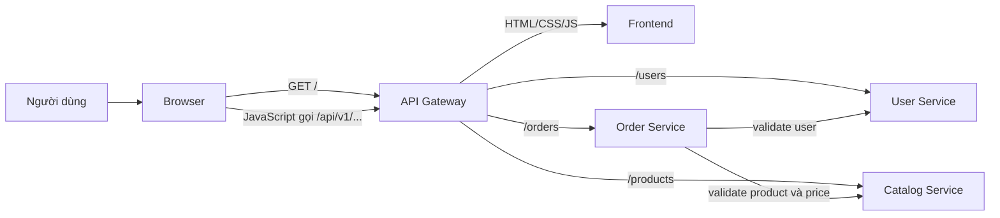

# DevOps

Repository này là nơi tích hợp và triển khai toàn bộ hệ thống: Docker Compose cho
local/E2E, Helm chart cho AKS, Azure Pipelines template dùng chung và các script
health/smoke. Runtime API Gateway nằm trong repository `api-gateway`, không nằm
trong repository này.

## Repository layout

```text
devops/
├── compose.yaml
├── deploy/helm/
│   ├── api-gateway/
│   ├── catalog-service/
│   ├── frontend/
│   ├── order-service/
│   └── user-service/
├── docs/api-contract.md
├── pipelines/
│   ├── system-e2e.yml
│   └── templates/service-pipeline.yml
└── scripts/
    ├── health.ps1
    ├── smoke.ps1
    └── wait-health.ps1
```

Sáu repository cần được clone cạnh nhau:

```text
AzureDevOps/
├── frontend/
├── user-service/
├── catalog-service/
├── order-service/
├── api-gateway/
└── devops/
```

## Request flow



Người dùng tương tác với giao diện React. Browser nhận frontend qua gateway và
các request do frontend tạo tiếp tục dùng URL tương đối `/api/v1/...`, vì vậy
browser chỉ giao tiếp với một origin. Các backend và frontend không publish cổng
ra host khi chạy Compose; chỉ `api-gateway` publish cổng `8080`.

## Chạy toàn bộ hệ thống

Yêu cầu Docker Engine có Compose v2. Từ repository này:

```powershell
Copy-Item .env.example .env
docker compose up --build --detach --wait
```

Mở:

- Ứng dụng: <http://localhost:8080>
- Dashboard health: <http://localhost:8080/health>
- Gateway health JSON: <http://localhost:8080/health/api-gateway>

Kiểm tra toàn hệ thống:

```powershell
./scripts/health.ps1 -BaseUrl http://localhost:8080
./scripts/smoke.ps1 -BaseUrl http://localhost:8080
```

Dừng stack:

```powershell
docker compose down --remove-orphans
```

Đổi version trả về từ tất cả health endpoint:

```powershell
$env:APP_VERSION = "local-2"
docker compose up --build --detach --wait
```

## Chạy từng service

Mỗi runtime repo có README riêng và có thể chạy native:

| Repository | Runtime | Cổng mặc định | Lệnh chính |
|---|---|---:|---|
| `frontend` | React, Vite | 5173 | `npm install`, `npm run dev` |
| `user-service` | Go, Gin | 8081 | `go run ./cmd/server` |
| `catalog-service` | Python, FastAPI | 8000 | `uvicorn app.main:app --port 8000` |
| `order-service` | Java, Spring Boot | 8083 | `./mvnw spring-boot:run` |
| `api-gateway` | Node.js HTTP | 8080 | `npm ci`, `npm start` |

Khi chạy native, `order-service` cần URL của User/Catalog và `api-gateway` cần
URL của cả bốn upstream. Xem biến môi trường cụ thể trong README của từng repo.

## Public routes

| Path | Destination |
|---|---|
| `/` và non-API path | Frontend |
| `/api/v1/users...` | User Service |
| `/api/v1/products...` | Catalog Service |
| `/api/v1/orders...` | Order Service |
| `/health` | Health dashboard do API Gateway phục vụ |
| `/health/{service}` | Health của từng component qua API Gateway |

API contract đầy đủ nằm tại [docs/api-contract.md](docs/api-contract.md).

## CI/CD ownership

Mỗi runtime repository sở hữu source, unit test, Dockerfile và một
`azure-pipelines.yml` ngắn. Năm file đó cùng extend:

```text
devops/pipelines/templates/service-pipeline.yml
```

Shared flow:

```text
Any branch: Test + Docker build + Trivy scan
main:       Push ACR -> Deploy DEV -> Health/Smoke -> Approval -> Deploy PROD
```

`pipelines/system-e2e.yml` checkout cả sáu repository, build năm image bằng
Compose rồi tạo order xuyên suốt qua public gateway. Chi tiết cấu hình Azure
DevOps nằm trong [pipelines/README.md](pipelines/README.md).

## AKS deployment

Compose chỉ dành cho local development và integration CI. DEV/PROD trên AKS dùng
năm Helm chart trong `deploy/helm`:

```powershell
helm lint ./deploy/helm/frontend
helm lint ./deploy/helm/user-service
helm lint ./deploy/helm/catalog-service
helm lint ./deploy/helm/order-service
helm lint ./deploy/helm/api-gateway
```

Namespace đề xuất là `dev` và `prod`. Chỉ Service của `api-gateway` có type
`LoadBalancer`; các application upstream dùng `ClusterIP`.

## Repository responsibilities

| Nơi sở hữu | Nội dung |
|---|---|
| Runtime repo | Source, unit test, Dockerfile, pipeline entrypoint |
| `api-gateway` | Routing runtime, health aggregation, request ID, upstream timeout |
| `devops` | Shared pipeline, Compose, Helm, E2E, scripts và API contract |

Không đặt application source hoặc logic routing trong `devops`. Không đặt Helm,
Compose hay shared pipeline template trong runtime repos.
