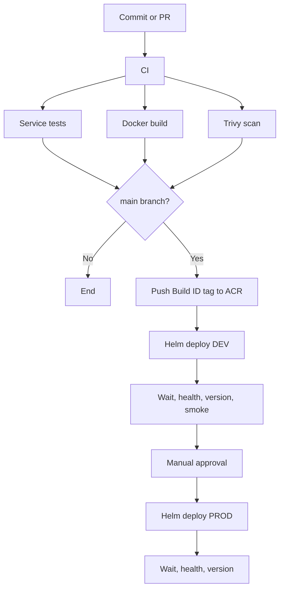

# NexusCart Azure Pipelines

NexusCart uses a minimal shared Azure Pipeline contract for the five runtime
repositories and one cross-repository pipeline for full-stack E2E validation.
Each runtime repository owns its variables, stages, jobs, and steps.

## ✨ Highlights

- One shared contract with repository-owned stage implementations.
- Per-service tests, Docker builds, and Trivy vulnerability scans.
- Immutable Azure Container Registry tags based on `$(Build.BuildId)`.
- The exact tested image is packaged as a pipeline artifact before publishing.
- Automated Helm deployment and integrated verification in DEV.
- Manual production approval followed by PROD deployment and health checks.
- Cross-repository Docker Compose E2E coverage.
- Automatic Compose diagnostics on E2E failure.

## 📋 Pipeline Inventory

| Azure Pipeline | YAML source | Purpose |
|---|---|---|
| `frontend` | `frontend/azure-pipelines.yml` | Frontend test, image, and deployment |
| `user-service` | `user-service/azure-pipelines.yml` | Go service test, image, and deployment |
| `catalog-service` | `catalog-service/azure-pipelines.yml` | Python service test, image, and deployment |
| `order-service` | `order-service/azure-pipelines.yml` | Java service test, image, and deployment |
| `api-gateway` | `api-gateway/azure-pipelines.yml` | Gateway test, image, and deployment |
| `system-e2e` | `config-management/pipelines/system-e2e.yml` | Six-repository Compose and smoke validation |

## 🔁 Runtime Service Flow



### Stage Behavior

| Stage | Branches | Result |
|---|---|---|
| `CI` | All | Tests in one job; Docker build and Trivy scan in another |
| `Push_ACR` | `main` | Loads the tested image artifact and pushes it to ACR |
| `Deploy_DEV` | `main` | Atomic Helm upgrade in namespace `dev` |
| `Verify_DEV` | `main` | Waits for all components, checks the deployed version, and runs smoke tests |
| `Approval` | `main` | Manual validation before production |
| `Deploy_PROD` | `main` | Atomic Helm upgrade in namespace `prod` |
| `Verify_PROD` | `main` | Waits for all components and checks the deployed version |

## 🧩 Pipeline Contract and Repository-Owned Stages

The shared contract is:

```text
pipelines/templates/pipeline-contract.yml
```

It defines only the compile-time `pipelineStages` interface required by Azure
Pipelines and renders the supplied `stageList`. It does not define service
variables, stage names, jobs, or steps. Those decisions stay in each runtime
repository.

Every runtime repository uses this layout:

```text
<service>/
├── azure-pipelines.yml
└── pipelines/
    └── stages/
        ├── ci.yml
        ├── deploy-dev.yml
        └── deploy-prod.yml
```

| Repository file | Owns |
|---|---|
| `azure-pipelines.yml` | Triggers, resources, variable groups, variables, and stage composition |
| `pipelines/stages/ci.yml` | Service tests, Docker build, Trivy scan, artifact publication, and ACR push |
| `pipelines/stages/deploy-dev.yml` | DEV deployment and verification stages, jobs, and steps |
| `pipelines/stages/deploy-prod.yml` | Approval, PROD deployment, and verification stages, jobs, and steps |
| `pipeline-contract.yml` | Only the shared `stageList` contract |

Example runtime entry point:

```yaml
resources:
  repositories:
    - repository: pipelineTemplates
      type: github
      endpoint: github-azure-devops-e2e
      name: Azure-DevOps-E2E/devops
      ref: refs/heads/main

variables:
  - group: nexuscart-shared
  - name: vmImage
    value: ubuntu-latest
  - name: serviceName
    value: user-service
  - name: imageRepository
    value: user-service
  - name: dockerfilePath
    value: Dockerfile
  - name: imageTag
    value: $(Build.BuildId)
  - name: fullImageName
    value: $(acrLoginServer)/$(imageRepository):$(imageTag)

extends:
  template: pipelines/templates/pipeline-contract.yml@pipelineTemplates
  parameters:
    pipelineStages:
      - template: pipelines/stages/ci.yml@self
      - template: pipelines/stages/deploy-dev.yml@self
      - template: pipelines/stages/deploy-prod.yml@self
```

`pipelines/templates/service-pipeline.yml` is retained temporarily as a legacy
rollback file. New and migrated pipelines must use `pipeline-contract.yml`.

## ✅ Per-Service Quality Gates

| Service | CI test command |
|---|---|
| `frontend` | `npm ci`, type-check, Vitest, and production build |
| `api-gateway` | `npm ci`, Node test runner, and syntax checks |
| `user-service` | `go test ./...` |
| `catalog-service` | Install development requirements and run Pytest |
| `order-service` | `./mvnw test` |

Every service image is also scanned with Trivy `0.72.0`. The scan ignores
vulnerabilities without an available fix and fails on the remaining `HIGH` or
`CRITICAL` findings.

## 🏷️ Image Tagging Strategy

| Environment | Tag | Purpose |
|---|---|---|
| CI | `$(Build.BuildId)` | Identifies the image built and scanned by one pipeline run |
| DEV | Same Build ID | Proves DEV runs the tested image |
| PROD | Same Build ID | Promotes the exact DEV-verified image |

The full image reference is:

```text
$(acrLoginServer)/<service>:$(Build.BuildId)
```

No image is rebuilt between CI, DEV, and PROD.

## ⚙️ Required Azure DevOps Setup

### GitHub Service Connection

Create and authorize a GitHub service connection named:

```text
github-azure-devops-e2e
```

It must be able to read all six repositories in the `Azure-DevOps-E2E`
organization.

The shared configuration repository is referenced by its actual GitHub name,
`Azure-DevOps-E2E/devops`, even when its local clone is named
`config-management`.

### Variable Group

Create a variable group named `nexuscart-shared`:

| Variable | Example or purpose |
|---|---|
| `acrLoginServer` | `example.azurecr.io` |
| `acrServiceConnection` | Docker Registry service connection for ACR |
| `azureServiceConnection` | Azure Resource Manager service connection |
| `aksResourceGroup` | Resource group that contains AKS |
| `aksClusterName` | Target AKS cluster |
| `devBaseUrl` | Public API Gateway URL for DEV |
| `prodBaseUrl` | Public API Gateway URL for PROD |
| `prodApprovers` | Users or email addresses notified for approval |

Mark credentials as secrets where applicable. Authorize the variable group and
all service connections for each pipeline.

### Environments

Create these Azure DevOps environments:

- `nexuscart-dev`
- `nexuscart-prod`

The YAML already contains a manual validation stage. Add Azure DevOps Approval
and checks to `nexuscart-prod` if an additional platform-level policy is
required.

### Required Template Enforcement

After one runtime pipeline has been validated successfully, open the
`github-azure-devops-e2e` service connection, select `Approvals and checks`,
and add a `Required template` check with:

| Field | Value |
|---|---|
| Repository type | `GitHub` |
| Repository | `Azure-DevOps-E2E/devops` |
| Ref | `refs/heads/main` |
| Path to required template | `pipelines/templates/pipeline-contract.yml` |

Keep the check disabled during the pilot so a configuration mistake does not
block all services at once.

`Pipeline permissions: No restrictions` only authorizes pipelines to use the
resource. It does not enforce a YAML template; `Required template` is the
separate policy that performs that enforcement.

## 🏗️ Create the Pipelines

1. Create five pipeline definitions from `/azure-pipelines.yml` in each
   runtime repository.
2. Name them exactly `frontend`, `user-service`, `catalog-service`,
   `order-service`, and `api-gateway`.
3. Create `system-e2e` from
   `config-management/pipelines/system-e2e.yml`.
4. Authorize repository resources, the variable group, and service
   connections on the first run.

The exact runtime pipeline names matter because `system-e2e` references them
as pipeline resources.

### Safe Rollout Order

1. Push the `devops` repository first so `pipeline-contract.yml`, Helm charts,
   and scripts exist on `main` before runtime pipelines compile.
2. Push and preview one pilot runtime pipeline, preferably `user-service`.
3. Migrate the remaining runtime repositories after the pilot is green.
4. Push the refactored `system-e2e` pipeline.
5. Enable the `Required template` check only after all target pipelines are
   using the contract.

## 🧪 System E2E Pipeline

`system-e2e` checks out:

```text
config-management + frontend + api-gateway + user-service
                  + catalog-service + order-service
```

It then:

1. Validates the Compose model.
2. Builds all five application images.
3. Starts the stack and waits for container health.
4. Checks component identity and version reporting.
5. Reads seeded users and products through the gateway.
6. Creates an order and reads it back.
7. Always stops the Compose environment.

The pipeline runs for changes and PRs in `config-management`. It is also
triggered after the `CI` stage succeeds on `main` for any runtime pipeline.

On failure, it publishes `docker compose ps --all` and service logs in the
`compose-diagnostics` artifact.

## 🚢 First Deployment Bootstrap

A service pipeline deploys one release and then verifies the complete system.
The first environment therefore needs all five images in ACR and all five Helm
releases.

Install the initial releases in dependency order:

```bash
helm upgrade --install user-service deploy/helm/user-service -n dev --create-namespace -f deploy/helm/user-service/values-dev.yaml
helm upgrade --install catalog-service deploy/helm/catalog-service -n dev -f deploy/helm/catalog-service/values-dev.yaml
helm upgrade --install order-service deploy/helm/order-service -n dev -f deploy/helm/order-service/values-dev.yaml
helm upgrade --install frontend deploy/helm/frontend -n dev -f deploy/helm/frontend/values-dev.yaml
helm upgrade --install api-gateway deploy/helm/api-gateway -n dev -f deploy/helm/api-gateway/values-dev.yaml
```

For each command, override `image.repository`, `image.tag`, and `appVersion`
with real ACR values. After bootstrap, each service pipeline manages its own
release.

## 🔍 Local Validation

```powershell
docker compose -f compose.yaml config --quiet
docker compose up --build --detach --wait
./scripts/health.ps1 -BaseUrl http://localhost:8080
./scripts/smoke.ps1 -BaseUrl http://localhost:8080
docker compose down --remove-orphans
```

Validate every Helm chart:

```bash
for chart in frontend user-service catalog-service order-service api-gateway; do
  helm lint "deploy/helm/$chart"
  helm template "$chart" "deploy/helm/$chart" >/dev/null
done
```

For the full system overview and local configuration, see
[the configuration-management README](../README.md).
