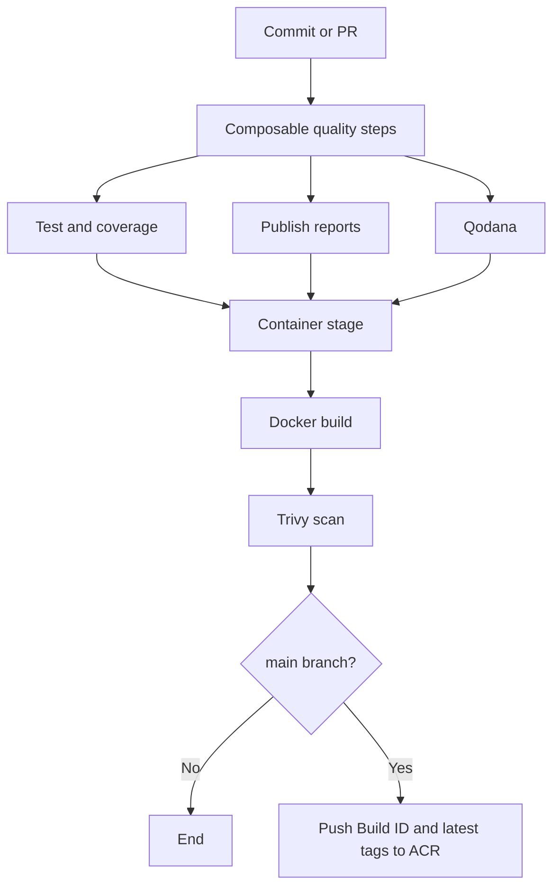

# NexusCart Azure Pipelines

NexusCart uses centralized Azure Pipeline templates for the five runtime
repositories and one cross-repository pipeline for full-stack E2E validation.
Runtime repositories contain only small entry points and compose reusable
quality steps.

## ✨ Highlights

- Shared stage, job, step, reporting, Qodana, Docker, and Trivy templates.
- JUnit test and code coverage reports for every service.
- Immutable Azure Container Registry tags based on `$(Build.BuildId)`.
- Qodana analysis selected through reusable technology-specific steps.
- Cross-repository Docker Compose E2E coverage.
- Automatic Compose diagnostics on E2E failure.

## 📋 Pipeline Inventory

| Azure Pipeline | YAML source | Purpose |
|---|---|---|
| `frontend` | `frontend/azure-pipelines.yml` | Frontend quality and container pipeline |
| `user-service` | `user-service/azure-pipelines.yml` | Go quality and container pipeline |
| `catalog-service` | `catalog-service/azure-pipelines.yml` | Python quality and container pipeline |
| `order-service` | `order-service/azure-pipelines.yml` | Java quality and container pipeline |
| `api-gateway` | `api-gateway/azure-pipelines.yml` | Gateway quality and container pipeline |
| `system-e2e` | `config-management/pipelines/system-e2e.yml` | Six-repository Compose and smoke validation |

## 🔁 Runtime Service Flow



### Stage Behavior

| Stage | Branches | Result |
|---|---|---|
| `CI` | All | Test, coverage, report publication, build checks, and Qodana |
| `Container` | All | Docker build and Trivy scan; ACR push only on `main` |

## 🧩 Composable Shared Templates

All reusable stage, job, and step implementations live in
`config-management/pipelines/templates`:

```text
templates/
├── service-stages.yml
├── stages/
│   ├── quality.yml
│   └── container.yml
├── jobs/
│   ├── quality.yml
│   └── container.yml
└── steps/
    ├── checkout.yml
    ├── reports.yml
    ├── qodana.yml
    ├── container.yml
    ├── node/
    ├── go/
    ├── python/
    └── maven/
```

`service-stages.yml` accepts a typed `stepList` named `qualitySteps`. A service
pipeline composes the exact building blocks it needs while keeping scripts and
tasks centralized:

```yaml
stages:
- template: pipelines/templates/service-stages.yml@configTemplates
  parameters:
    serviceName: user-service
    imageName: user-service
    dockerfilePath: Dockerfile
    containerRegistry: acrLoginServer
    qualitySteps:
    - template: pipelines/templates/steps/checkout.yml@configTemplates
    - template: pipelines/templates/steps/go/setup.yml@configTemplates
    - template: pipelines/templates/steps/go/test.yml@configTemplates
    - template: pipelines/templates/steps/go/verify.yml@configTemplates
    - template: pipelines/templates/steps/reports.yml@configTemplates
    - template: pipelines/templates/steps/qodana.yml@configTemplates
      parameters:
        linter: qodana-go
        requiresToken: true
```

This keeps the service flow explicit while every implementation remains
reusable by another repository.

## ✅ Reusable Quality Steps

| Step family | Reusable templates |
|---|---|
| Common | Checkout, test/coverage publication, and Qodana |
| Node.js | Runtime setup, `npm ci`, Vitest, native test runner, and npm scripts |
| Go | Runtime setup, Gotestsum/Cobertura test, vet, and build |
| Python | Runtime setup, dependency install, Pytest/Cobertura, Ruff, and compile |
| Maven | Java setup and Maven verify with Surefire/JaCoCo output |

Every service image is also scanned with Trivy `0.72.0`. The scan ignores
vulnerabilities without an available fix and fails on the remaining `HIGH` or
`CRITICAL` findings.

## 🏷️ Image Tagging Strategy

| Branch | Tags pushed to ACR |
|---|---|
| `main` | `$(Build.BuildId)` and `latest` |
| Other branches and PRs | None; the image is built and scanned on the agent |

The full image reference is:

```text
$(acrLoginServer)/<service>:$(Build.BuildId)
```

The image that passes Trivy is the image pushed on `main`.

## ⚙️ Required Azure DevOps Setup

### GitHub Service Connection

Create and authorize a GitHub service connection named:

```text
github.com_Azure-DevOps-E2E
```

It must be able to read all six repositories in the `Azure-DevOps-E2E`
organization.

The shared repository is `Azure-DevOps-E2E/config-management`.

### ACR Service Connection

Create and authorize a Docker Registry service connection named
`acrLoginServer`. The shared container template passes this literal service
connection name to `Docker@2`.

### Qodana

Install the Qodana Azure Pipelines extension in the Azure DevOps organization.
Create a secret pipeline variable named `QODANA_TOKEN` for:

- `frontend` and `api-gateway`, which use `qodana-js`.
- `user-service`, which uses `qodana-go`.

Use the project-specific token generated for each Qodana Cloud project.
`catalog-service` and `order-service` use Community linters and do not require
a token.

### Required Template Enforcement

After one runtime pipeline has been validated successfully, open the
`github.com_Azure-DevOps-E2E` service connection, select `Approvals and checks`,
and add a `Required template` check with:

| Field | Value |
|---|---|
| Repository type | `GitHub` |
| Repository | `Azure-DevOps-E2E/config-management` |
| Ref | `refs/heads/main` |
| Path to required template | `pipelines/templates/service-stages.yml` |

Keep the check disabled during the pilot so a configuration mistake does not
block all services at once.

`Pipeline permissions: No restrictions` only authorizes pipelines to use the
resource. It does not enforce a YAML template; `Required template` is the
separate policy that performs that enforcement.

## 🏗️ Create the Pipelines

1. Create five pipeline definitions from `/azure-pipelines.yml` in each
   runtime repository.
2. Name them exactly `frontend`, `user-service`, `catalog-service`,
   `order-service`, and `api-gateway`.
3. Create `system-e2e` from
   `config-management/pipelines/system-e2e.yml`.
4. Authorize the shared GitHub repository and `acrLoginServer` service
   connection on the first run.

The exact runtime pipeline names matter because `system-e2e` references them
as pipeline resources.

### Safe Rollout Order

1. Push `config-management` first so all referenced stage, job, and step
   templates exist on `main` before runtime pipelines compile.
2. Push and preview one pilot runtime pipeline, preferably `user-service`.
3. Migrate the remaining runtime repositories after the pilot is green.
4. Push the refactored `system-e2e` pipeline.
5. Enable the `Required template` check only after all target pipelines include
   `service-stages.yml`.

## 🧪 System E2E Pipeline

`system-e2e` checks out:

```text
config-management + frontend + api-gateway + user-service
                  + catalog-service + order-service
```

It then:

1. Validates the Compose model.
2. Builds all five application images.
3. Starts the stack and waits for container health.
4. Checks component identity and version reporting.
5. Reads seeded users and products through the gateway.
6. Creates an order and reads it back.
7. Always stops the Compose environment.

The pipeline runs for changes and PRs in `config-management`. It is also
triggered after the `CI` stage succeeds on `main` for any runtime pipeline.

On failure, it publishes `docker compose ps --all` and service logs in the
`compose-diagnostics` artifact.

## 🚢 Deployment Scope

Runtime service pipelines stop after the tested image is pushed to ACR. Helm
charts remain in `config-management`, but deployment is intentionally separate
from these CI pipelines.

For a manual DEV bootstrap, install releases in dependency order:

```bash
helm upgrade --install user-service deploy/helm/user-service -n dev --create-namespace -f deploy/helm/user-service/values-dev.yaml
helm upgrade --install catalog-service deploy/helm/catalog-service -n dev -f deploy/helm/catalog-service/values-dev.yaml
helm upgrade --install order-service deploy/helm/order-service -n dev -f deploy/helm/order-service/values-dev.yaml
helm upgrade --install frontend deploy/helm/frontend -n dev -f deploy/helm/frontend/values-dev.yaml
helm upgrade --install api-gateway deploy/helm/api-gateway -n dev -f deploy/helm/api-gateway/values-dev.yaml
```

For each command, override `image.repository`, `image.tag`, and `appVersion`
with real ACR values.

## 🔍 Local Validation

```powershell
docker compose -f compose.yaml config --quiet
docker compose up --build --detach --wait
./scripts/health.ps1 -BaseUrl http://localhost:8080
./scripts/smoke.ps1 -BaseUrl http://localhost:8080
docker compose down --remove-orphans
```

Validate every Helm chart:

```bash
for chart in frontend user-service catalog-service order-service api-gateway; do
  helm lint "deploy/helm/$chart"
  helm template "$chart" "deploy/helm/$chart" >/dev/null
done
```

For the full system overview and local configuration, see
[the configuration-management README](../README.md).
