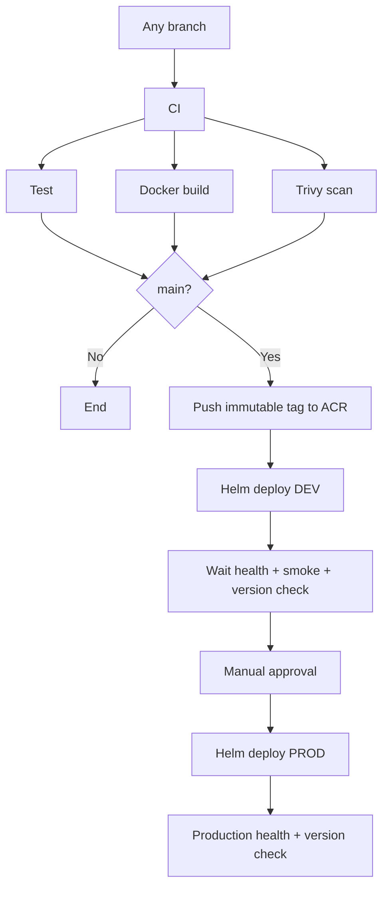

# Azure Pipelines

Hệ thống dùng một template CI/CD chung cho năm runtime repository và một pipeline
integration riêng trong repository `devops`.

## Pipeline inventory

| Azure pipeline name | YAML source | Chức năng |
|---|---|---|
| `frontend` | `frontend/azure-pipelines.yml` | Test/build/scan/push/deploy frontend |
| `user-service` | `user-service/azure-pipelines.yml` | Test/build/scan/push/deploy Go service |
| `catalog-service` | `catalog-service/azure-pipelines.yml` | Test/build/scan/push/deploy Python service |
| `order-service` | `order-service/azure-pipelines.yml` | Test/build/scan/push/deploy Java service |
| `api-gateway` | `api-gateway/azure-pipelines.yml` | Test/build/scan/push/deploy gateway |
| `system-e2e` | `devops/pipelines/system-e2e.yml` | Checkout 6 repo, Compose E2E và smoke test |

## Shared service flow



Template dùng chung là `pipelines/templates/service-pipeline.yml`. Mỗi runtime
pipeline chỉ truyền `serviceName`, `imageRepository`, `testCommand` và
`dockerfilePath`. Image tag là `$(Build.BuildId)`; đúng image đã build và scan
được đóng gói làm pipeline artifact rồi mới push khi branch là `main`.

## Required Azure DevOps setup

Tạo GitHub service connection tên:

```text
github-azure-devops-e2e
```

Tạo variable group `nexuscart-shared` với các key:

| Variable | Ví dụ |
|---|---|
| `acrLoginServer` | `example.azurecr.io` |
| `acrServiceConnection` | Tên Docker Registry service connection |
| `azureServiceConnection` | Tên Azure Resource Manager service connection |
| `aksResourceGroup` | Resource group chứa AKS |
| `aksClusterName` | Tên AKS cluster |
| `devBaseUrl` | Public gateway URL của DEV |
| `prodBaseUrl` | Public gateway URL của PROD |
| `prodApprovers` | Email/user được phép approve PROD |

Đánh dấu secret cho credential nếu có. Authorize variable group và service
connections cho cả sáu pipeline.

Tạo Azure DevOps Environments `nexuscart-dev` và `nexuscart-prod`. Manual
validation đã nằm giữa DEV và PROD; có thể thêm Approval and checks vào
environment PROD để có thêm policy ở cấp platform.

## Create pipeline definitions

Tạo năm pipeline runtime từ file `/azure-pipelines.yml` ở mỗi repo. Tạo pipeline
thứ sáu tên `system-e2e`, trỏ tới:

```text
devops/pipelines/system-e2e.yml
```

Giữ chính xác tên năm pipeline runtime trong bảng trên vì `system-e2e` tham chiếu
chúng bằng pipeline resources. Pipeline E2E chạy khi chính repo `devops` thay đổi,
có thể queue thủ công, và cũng được trigger sau stage `CI` thành công trên `main`
của bất kỳ runtime pipeline nào.

## First deployment bootstrap

Service pipeline triển khai một release độc lập và sau đó smoke test cả hệ thống.
Vì vậy lần triển khai đầu tiên cần có đủ năm image trong ACR và đủ năm Helm
release. Sau khi build/push initial images, cài theo thứ tự:

```bash
helm upgrade --install user-service deploy/helm/user-service -n dev --create-namespace -f deploy/helm/user-service/values-dev.yaml
helm upgrade --install catalog-service deploy/helm/catalog-service -n dev -f deploy/helm/catalog-service/values-dev.yaml
helm upgrade --install order-service deploy/helm/order-service -n dev -f deploy/helm/order-service/values-dev.yaml
helm upgrade --install frontend deploy/helm/frontend -n dev -f deploy/helm/frontend/values-dev.yaml
helm upgrade --install api-gateway deploy/helm/api-gateway -n dev -f deploy/helm/api-gateway/values-dev.yaml
```

Ghi đè `image.repository`, `image.tag` và `appVersion` bằng giá trị thực tế trong
ACR. Sau bootstrap, từng pipeline tự deploy đúng chart tương ứng.

## E2E behavior

`system-e2e` checkout:

```text
devops + frontend + user-service + catalog-service + order-service + api-gateway
```

Nó validate Compose, build/start stack, kiểm tra health/version của năm component,
đọc user/product, tạo order và đọc lại order qua gateway. Khi thất bại, pipeline
publish `docker compose ps` và logs rồi luôn chạy `docker compose down`.

## Local validation

```powershell
docker compose -f compose.yaml config --quiet
./scripts/health.ps1 -BaseUrl http://localhost:8080
./scripts/smoke.ps1 -BaseUrl http://localhost:8080
```

Validate tất cả chart:

```bash
for chart in frontend user-service catalog-service order-service api-gateway; do
  helm lint "deploy/helm/$chart"
  helm template "$chart" "deploy/helm/$chart" >/dev/null
done
```
